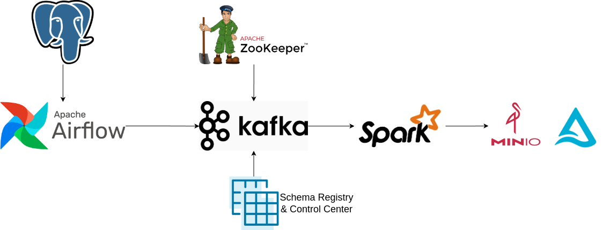

# Data Pipeline using Airflow, PostgreSQL, Kafka, Zookeeper, Spark, MinIO, and Delta Lake

## Overview
This project implements a data pipeline using the following technologies:

- **Apache Airflow**: Workflow orchestration and scheduling.
- **PostgreSQL**: Stores metadata for Airflow.
- **Kafka**: Message broker for real-time data streaming.
- **Zookeeper**: Manages and coordinates Kafka brokers.
- **Apache Spark**: Processes data in batch and streaming modes.
- **MinIO**: Object storage for raw and processed data.
- **Delta Lake**: Provides ACID transactions on top of Apache Spark and MinIO.

## Architecture

1. **Data Ingestion**:
   - Data is ingested into Kafka from various sources.
   - Kafka producers push raw data into Kafka topics.
   - Zookeeper manages Kafka brokers for distributed message streaming.

2. **Data Processing**:
   - Apache Spark consumes data from Kafka.
   - Spark performs transformations and writes structured data into Delta Lake stored in MinIO.

3. **Storage**:
   - Raw data is stored in MinIO.
   - Processed data is structured as Delta tables for efficient querying and updates.

4. **Workflow Orchestration**:
   - Apache Airflow schedules and manages Spark jobs.
   - Airflow metadata is stored in PostgreSQL.

## Technologies & Tools

| Component  | Technology |
|------------|------------|
| Workflow Orchestration | Apache Airflow |
| Metadata Storage | PostgreSQL |
| Streaming Platform | Apache Kafka |
| Coordination Service | Apache Zookeeper |
| Data Processing | Apache Spark |
| Object Storage | MinIO |
| Data Lake | Delta Lake |

## Installation

### Prerequisites
Ensure you have the following installed:
- Docker & Docker Compose
- Python 3.8+
- Java 8+

### Steps
1. Clone the repository:
   ```sh
   git clone https://github.com/your-repo/datapipeline.git
   cd datapipeline
   ```
2. Start the services using Docker Compose:
   ```sh
   docker-compose up -d
   ```
3. Access the Airflow UI:
   - Open `http://localhost:8080`
   - Username: `airflow`
   - Password: `airflow`

4. Access the Minio UI:
   - Open `http://localhost:9001`
   - Username: `minio_admin`
   - Password: `minio_admin`

5. Access the Control Center:
   - Open `http://localhost:9021`   

## Usage
- Use Airflow to trigger Spark jobs for processing data.
- Publish events to Kafka topics and monitor the data flow.
- Query processed data stored in Delta Lake using Spark.

## Contributing
Contributions are welcome! Feel free to open issues and pull requests.
